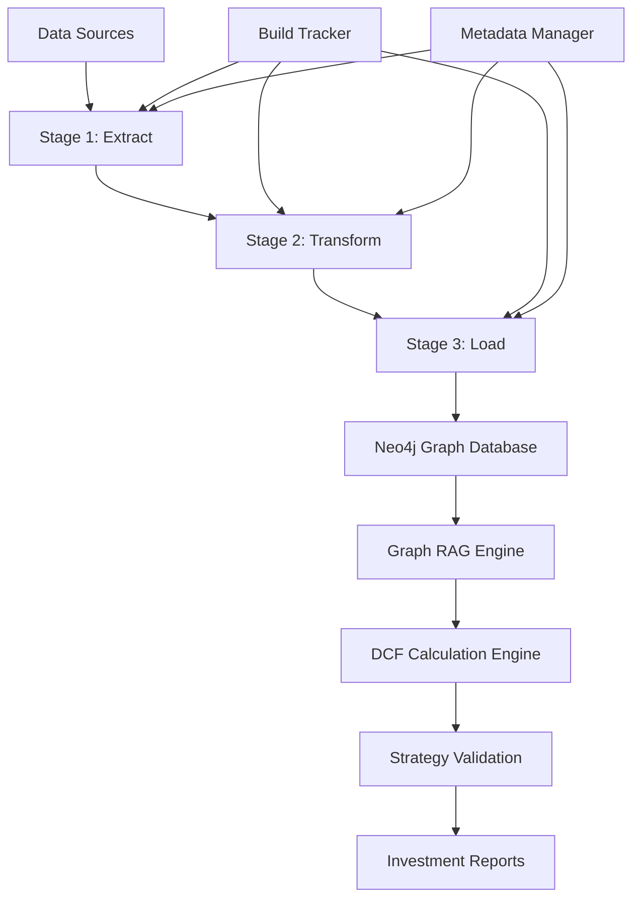

# System Architecture Overview

## Vision Statement

My Finance is a **Graph RAG-powered DCF valuation and investment analysis system** designed to provide:
- Intrinsic value calculations through DCF models
- Investment recommendations with confidence scores
- Multi-factor risk analysis 
- Strategy validation against market benchmarks

## Architectural Principles

### 1. **Separation of Concerns**
- **Data Layer**: ETL pipeline with stage-based processing
- **Storage Layer**: Neo4j graph database + file system
- **Processing Layer**: DCF engine + Graph RAG system
- **Interface Layer**: API + CLI + Reports

### 2. **Scalability by Design**
- **Four-tier data strategy**: TEST → M7 → NASDAQ100 → VTI
- **Configuration-driven**: One codebase, multiple datasets
- **Incremental processing**: Date-partitioned ETL stages
- **Horizontal scaling**: Graph database + distributed processing

### 3. **Enterprise Patterns**
- **Build tracking**: Every execution documented
- **Anti-duplicate downloads**: Quota-aware data collection  
- **Comprehensive metadata**: Full lineage tracking
- **Observability**: Logging, monitoring, and debugging

## System Components

### Data Sources
- **YFinance**: Market data, price history, company metrics
- **SEC Edgar**: Financial filings (10-K, 10-Q, 8-K)
- **Future**: News feeds, analyst reports, alternative data

### ETL Pipeline
- **Stage 1 (Extract)**: Raw data collection with date partitioning
- **Stage 2 (Transform)**: Data cleaning, enrichment, normalization
- **Stage 3 (Load)**: Graph nodes, embeddings, DCF calculations

### Analysis Engine
- **DCF Calculator**: Multi-model valuation framework
- **Graph RAG**: Context-aware financial reasoning
- **Risk Assessment**: Factor-based risk modeling
- **Strategy Validation**: Backtesting and benchmarking

## Data Architecture

### Four-Tier Strategy

| Tier | Size | Purpose | Storage | Update Frequency |
|------|------|---------|---------|------------------|
| **TEST** | 1 company | CI/CD validation | Temporary | On-demand |
| **M7** | 7 companies | Development testing | Git-tracked | Manual |
| **NASDAQ100** | ~100 companies | Integration validation | Buildable | Weekly |
| **VTI** | ~4000 companies | Production analysis | Production | Daily |

### Data Warehouse Design
- **Partitioning**: Daily partitions (YYYYMMDD) for incremental loading
- **Metadata**: README.md files with schema and lineage information
- **Retention**: Configurable per stage (30/90/365 days)
- **Symlinks**: `latest` pointers for easy access

## Technology Stack

### Core Technologies
- **Language**: Python 3.12+
- **Database**: Neo4j 5.0+ (graph database)
- **Package Management**: Pixi (cross-platform)
- **Infrastructure**: Docker, Kubernetes (Minikube)
- **Version Control**: Git with submodules

### Key Libraries
- **Data Processing**: pandas, numpy, yfinance
- **Graph Database**: neomodel (Neo4j ORM)
- **ML/AI**: transformers, sentence-transformers
- **Web**: requests, beautifulsoup4
- **Testing**: pytest, coverage

## Deployment Architecture

### Development Environment
- **Local Development**: Pixi environment with Docker services
- **Services**: Neo4j (local), data processing (local)
- **Storage**: Local filesystem with git-tracked data submodule

### Production Architecture (Future)
- **Container Platform**: Kubernetes cluster
- **Data Storage**: Distributed object storage + Neo4j cluster
- **Processing**: Distributed computing framework
- **Monitoring**: Prometheus + Grafana + ELK stack

## Security & Compliance

### Data Security
- **Access Control**: Role-based permissions
- **Data Encryption**: At-rest and in-transit
- **Audit Logging**: Complete operation tracking
- **Privacy**: PII handling and GDPR compliance

### API Security
- **Authentication**: JWT tokens
- **Authorization**: Resource-based access control
- **Rate Limiting**: API quota management
- **Input Validation**: Schema-based validation

## Performance Characteristics

### Target Performance
- **Data Collection**: <5 minutes for M7, <30 minutes for NASDAQ100
- **DCF Calculation**: <1 second per company
- **Graph RAG Query**: <3 seconds average response time
- **Report Generation**: <10 seconds for comprehensive analysis

### Scalability Targets
- **Concurrent Users**: 100+ simultaneous analysis requests
- **Data Volume**: 10TB+ financial data processing capability
- **Query Performance**: Sub-second graph traversal for 100K+ nodes

## Quality Assurance

### Testing Strategy
- **Unit Tests**: Component-level validation
- **Integration Tests**: End-to-end workflow testing
- **Performance Tests**: Load and scalability validation
- **Data Quality Tests**: Accuracy and consistency validation

### Monitoring & Observability
- **Application Metrics**: Performance, usage, errors
- **Data Quality Metrics**: Completeness, accuracy, timeliness
- **Infrastructure Metrics**: Resource utilization, availability
- **Business Metrics**: Analysis accuracy, user satisfaction

---

*This architecture overview defines the high-level system design. Implementation details are documented in component-specific READMEs and GitHub Issues.*